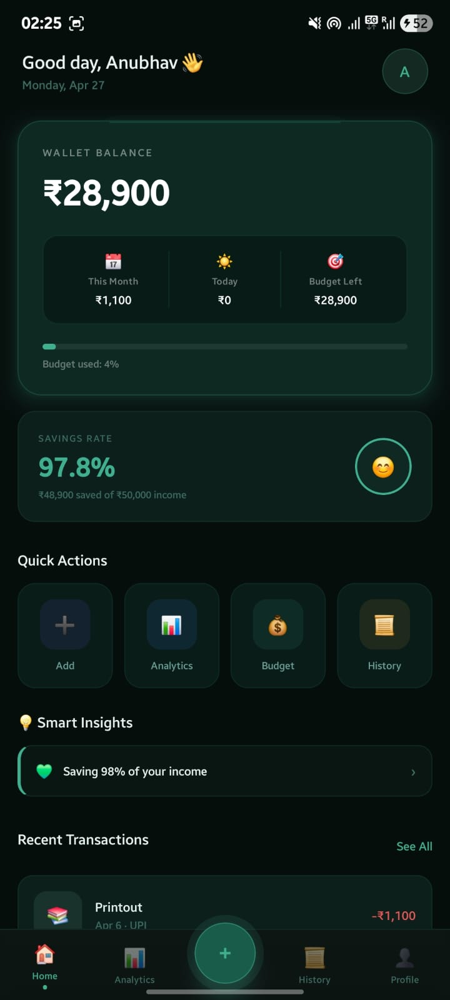
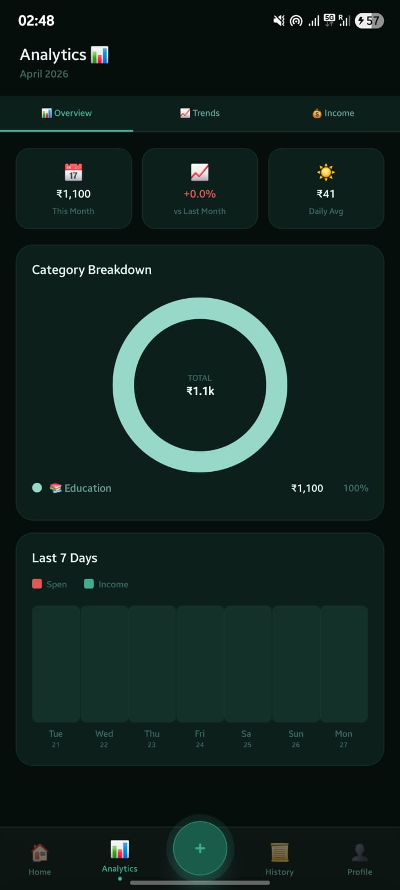
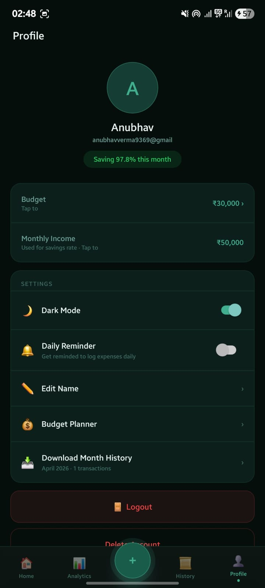

#  Splendly — Spend Wisely

<div align="center">


**Spend Wisely.**

Splendly is a beautiful, AI-powered personal finance app built with React Native & Expo. Track daily expenses, manage budgets, visualize your spending patterns, and build smarter money habits — all from your pocket.

[📱 Try on Expo Go](#-try-it-now) · [✨ Features](#-features) · [🚀 Setup](#-getting-started) · [📸 Screenshots](#-screenshots)

</div>

---

## 📱 Try It Now

> **Scan the QR code below with Expo Go to try Splendly instantly — no install needed!**


```
exp://10.158.240.205:8081
```

**Steps:**
1. Install **Expo Go** on Android → [Play Store](https://play.google.com/store/apps/details?id=host.exp.exponent)
2. Open Expo Go → Tap **Scan QR Code**
3. Scan above and you're in!

> ⚠️ Requires Expo Go **SDK 54**. Download here if needed:
> [expo.dev/go?sdkVersion=54&platform=android](https://expo.dev/go?sdkVersion=54&platform=android&device=true)

---

## 📸 Screenshots

<div align="center">

&nbsp;

&nbsp;

</div>


## ✨ Features

### 🔐 Authentication
- Email & Password Sign Up / Login via **Firebase Auth**
- Persistent login session — stays logged in across restarts
- Secure logout from Profile screen

### 🏠 Home Dashboard
- Wallet balance with monthly budget progress bar
- This month's spending + today's total + budget left
- Savings rate card
- Smart insight cards (overspending alerts, savings tips)
- Recent transactions list

### ➕ Add Expense
- Fast expense entry with amount, category, note, date, payment method
- **Auto category detection** — type "Uber" → Transport auto-selected
- One-tap quick-add from recent expenses
- 13 built-in colorful categories
- Recurring transaction toggle

### 📊 Analytics
- Last 7 days bar chart
- Category spending breakdown with visual progress bar
- Month-over-month comparison chart
- Daily average spend + top category highlight

### 📜 History
- Full transaction history grouped by date
- Search by note or category
- Filter & sort by date or amount
- Long-press to delete any transaction

### 💰 Budget Planner
- Set monthly total budget
- Per-category budget limits
- Color-coded progress bars (green → yellow → red)
- Real-time over-budget warnings

### 👤 Profile & Settings
- Edit display name via modal
- Dark / Light mode toggle
- Currency selection (₹ INR, $ USD, € EUR, £ GBP)
- Firebase-backed secure account

---

## 🛠 Tech Stack

| Layer | Technology |
|-------|-----------|
| Framework | React Native 0.73 + Expo SDK 54 |
| Language | TypeScript |
| Navigation | React Navigation v6 (Stack + Bottom Tabs) |
| State Management | Zustand + AsyncStorage persistence |
| Authentication | Firebase Auth (Email/Password) |
| Styling | StyleSheet API + Linear Gradient |

---

## 🚀 Getting Started

### Prerequisites
- Node.js 18+
- Expo Go app on Android

### 1. Clone the repo
```bash
git clone https://github.com/YOUR_USERNAME/Splendly.git
cd Splendly
```

### 2. Install dependencies
```bash
npm install --legacy-peer-deps
```

### 3. Configure Firebase
- Go to [console.firebase.google.com](https://console.firebase.google.com)
- Create a project → Enable **Authentication → Email/Password**
- Copy config into `src/services/firebase.ts`:

```typescript
const firebaseConfig = {
  apiKey: "YOUR_API_KEY",
  authDomain: "YOUR_PROJECT.firebaseapp.com",
  projectId: "YOUR_PROJECT_ID",
  storageBucket: "YOUR_PROJECT.appspot.com",
  messagingSenderId: "YOUR_SENDER_ID",
  appId: "YOUR_APP_ID"
};
```

### 4. Start
```bash
npx expo start
```

Scan the QR with Expo Go on your phone.

---

## 📁 Project Structure

```
Splendly/
├── App.tsx                          # Entry point + Firebase auth listener
├── assets/
│   └── icon.png                     # App icon
├── src/
│   ├── constants/index.ts           # Categories, themes, currencies
│   ├── hooks/useTheme.ts            # Theme + currency hooks
│   ├── navigation/index.tsx         # Navigation setup
│   ├── screens/
│   │   ├── auth/
│   │   │   ├── LoginScreen.tsx      # Sign In / Sign Up
│   │   │   └── OnboardingScreen.tsx # First-time onboarding
│   │   └── main/
│   │       ├── HomeScreen.tsx       # Dashboard
│   │       ├── AddExpenseScreen.tsx # Add expense
│   │       ├── AnalyticsScreen.tsx  # Charts & analytics
│   │       ├── HistoryScreen.tsx    # Transaction history
│   │       ├── ProfileScreen.tsx    # Profile & settings
│   │       └── BudgetScreen.tsx     # Budget planner
│   ├── services/
│   │   └── firebase.ts             # Firebase config & auth
│   ├── store/index.ts              # Zustand global state
│   └── types/index.ts              # TypeScript interfaces
```

---

## 🏗 Building for Production

### Android (EAS Build — recommended)
```bash
npm install -g eas-cli
eas login
eas build --platform android
```

### Local APK
```bash
npx expo run:android --variant release
```

---

## 🗺 Roadmap

- [x] Firebase Authentication
- [x] Expense tracking with auto-categorization
- [x] Budget planner with real-time alerts
- [x] Analytics with bar charts
- [x] Dark / Light mode
- [x] Export to CSV / PDF
- [ ] Google Sign-In
- [ ] Phone OTP Login
- [ ] AI insights (Claude API)
- [ ] Receipt photo scanning
- [ ] Voice input ("Spent ₹250 on lunch")
- [ ] Play Store release 🚀

---

## 🤝 Contributing

Pull requests are welcome!

1. Fork the repo
2. Create your branch: `git checkout -b feature/AmazingFeature`
3. Commit: `git commit -m 'Add AmazingFeature'`
4. Push: `git push origin feature/AmazingFeature`
5. Open a Pull Request

---

## 📄 License

MIT License — see [LICENSE](LICENSE) for details.

---

## 👨‍💻 Author

**Anubhav Verma**

[](https://github.com/YOUR_USERNAME)

---

<div align="center">


### Splendly — Spend Wisely 💚

⭐ If you find this useful, give it a star!

</div>
